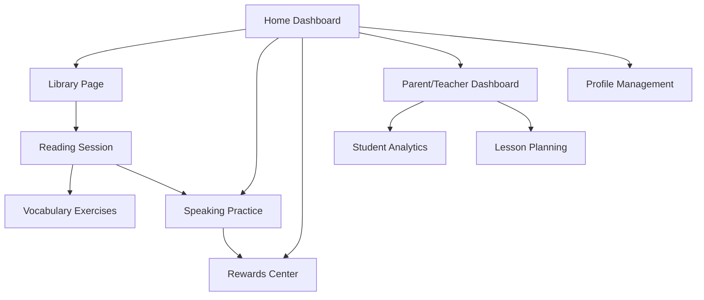

# Interactive English Tutor - Product Requirements Document

## 1. Product Overview
An interactive web application designed to help children learn English through engaging picture book reading, vocabulary building, and speaking practice with AI-powered features.

The platform addresses the need for personalized English learning for children by combining visual storytelling, interactive exercises, and speech recognition technology. Parents and teachers can monitor progress and customize learning experiences to maximize educational outcomes.

## 2. Core Features

### 2.1 User Roles

| Role | Registration Method | Core Permissions |
|------|---------------------|------------------|
| Child User | Parent/teacher registration with parental consent | Access reading sessions, practice modules, view rewards |
| Parent | Email registration with verification | Monitor child progress, customize settings, manage accounts |
| Teacher | Institution-based registration with admin approval | Manage multiple students, create lesson plans, view analytics |
| Admin | System-level access | Platform management, user administration, content moderation |

### 2.2 Feature Module

Our interactive English tutor consists of the following main pages:
1. **Home Dashboard**: Welcome interface, quick access to recent activities, progress overview, navigation menu.
2. **Library Page**: Book upload interface, book collection display, search and filter options, reading history.
3. **Reading Session Page**: Interactive book reader, text highlighting, audio playback controls, vocabulary exercises.
4. **Speaking Practice Page**: Voice recording interface, pronunciation evaluation, conversation practice with AI, progress tracking.
5. **Rewards Center**: Achievement display, badge collection, progress milestones, motivation system.
6. **Parent/Teacher Dashboard**: Student progress analytics, lesson plan management, performance reports, account settings.
7. **Profile Management**: User settings, account information, privacy controls, subscription management.

### 2.3 Page Details

| Page Name | Module Name | Feature description |
|-----------|-------------|---------------------|
| Home Dashboard | Welcome Interface | Display personalized greeting, recent activities, and quick navigation to main features |
| Home Dashboard | Progress Overview | Show learning streaks, completed lessons, and next recommended activities |
| Home Dashboard | Quick Actions | Provide one-click access to continue reading, start practice session, or view rewards |
| Library Page | File Upload | Secure upload for PDF, JPG, PNG files with format validation and file size limits |
| Library Page | Book Collection | Grid display of uploaded books with thumbnails, titles, and reading progress indicators |
| Library Page | Search & Filter | Find books by title, difficulty level, topic, or reading status |
| Reading Session Page | Interactive Reader | Display book content with zoom controls, page navigation, and fullscreen mode |
| Reading Session Page | Text Highlighting | Synchronized highlighting of text during audio playback with adjustable speed |
| Reading Session Page | Audio Controls | Play, pause, rewind, speed adjustment, and volume control for narration |
| Reading Session Page | Vocabulary Builder | Interactive word definitions, pronunciation guides, and vocabulary exercises |
| Speaking Practice Page | Voice Recording | Record pronunciation attempts with playback functionality and quality indicators |
| Speaking Practice Page | Pronunciation Evaluation | AI-powered assessment with scoring, feedback, and improvement suggestions |
| Speaking Practice Page | Conversation Practice | Interactive dialogue with AI responses and guided conversation scenarios |
| Speaking Practice Page | Progress Tracking | Visual progress charts, skill improvement metrics, and achievement milestones |
| Rewards Center | Achievement Display | Showcase earned badges, certificates, and completed challenges |
| Rewards Center | Progress Milestones | Visual representation of learning journey with unlockable content |
| Rewards Center | Motivation System | Daily challenges, streak counters, and reward redemption options |
| Parent/Teacher Dashboard | Student Analytics | Detailed progress reports, time spent learning, and skill development charts |
| Parent/Teacher Dashboard | Lesson Planning | Create custom reading lists, set learning goals, and schedule practice sessions |
| Parent/Teacher Dashboard | Performance Reports | Generate printable reports with learning outcomes and recommendations |
| Profile Management | Account Settings | Manage personal information, notification preferences, and privacy settings |
| Profile Management | Subscription Management | View plan details, billing information, and upgrade options |

## 3. Core Process

**Child User Flow:**
Children log in through the home dashboard, select a book from their library, engage in interactive reading sessions with text highlighting and audio, complete vocabulary exercises, practice speaking with AI feedback, and earn rewards for completed activities.

**Parent/Teacher Flow:**
Parents and teachers access the dashboard to upload new books, monitor student progress through analytics, customize lesson plans, review performance reports, and adjust learning settings based on individual needs.

## 4. User Interface Design

### 4.1 Design Style
- **Primary Colors**: Bright blue (#4A90E2) and warm orange (#F5A623) for engagement
- **Secondary Colors**: Soft green (#7ED321) for success, light purple (#BD10E0) for achievements
- **Button Style**: Rounded corners with subtle shadows and hover animations
- **Font**: Child-friendly sans-serif fonts (Nunito or Comic Neue) with large, readable sizes (16px-24px)
- **Layout Style**: Card-based design with generous spacing and intuitive navigation
- **Icons**: Colorful, playful icons with consistent style and clear meaning

### 4.2 Page Design Overview

| Page Name | Module Name | UI Elements |
|-----------|-------------|-------------|
| Home Dashboard | Welcome Interface | Large welcome banner with child's name, colorful progress rings, animated mascot character |
| Home Dashboard | Quick Actions | Large, colorful buttons with icons, hover effects, and clear labels |
| Library Page | Book Collection | Grid layout with book cover thumbnails, progress bars, star ratings, and filter sidebar |
| Reading Session Page | Interactive Reader | Clean reading area with minimal distractions, floating audio controls, highlighting animations |
| Speaking Practice Page | Voice Interface | Large microphone button, waveform visualization, score displays with animations |
| Rewards Center | Achievement Display | Badge gallery with unlock animations, progress bars, and celebration effects |
| Parent/Teacher Dashboard | Analytics | Clean charts and graphs, data tables, export buttons, and filtering options |

### 4.3 Responsiveness
The application is designed mobile-first with responsive breakpoints for tablets and desktops. Touch interactions are optimized for children's use with large touch targets, swipe gestures for navigation, and haptic feedback where supported. The interface adapts seamlessly across devices while maintaining child-friendly design principles.