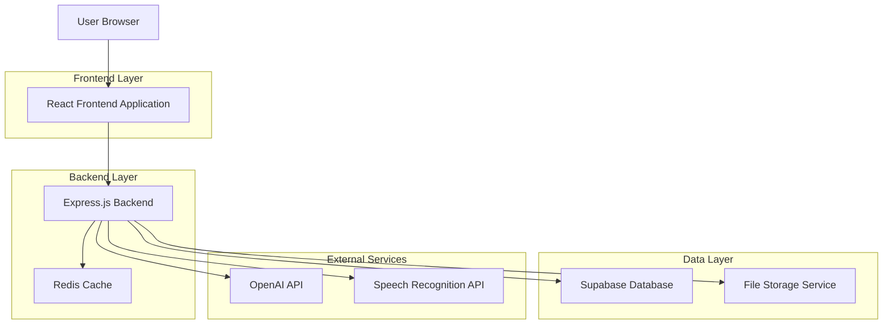
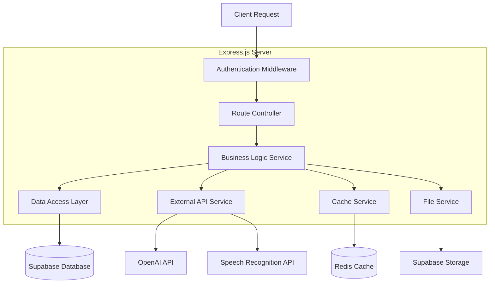
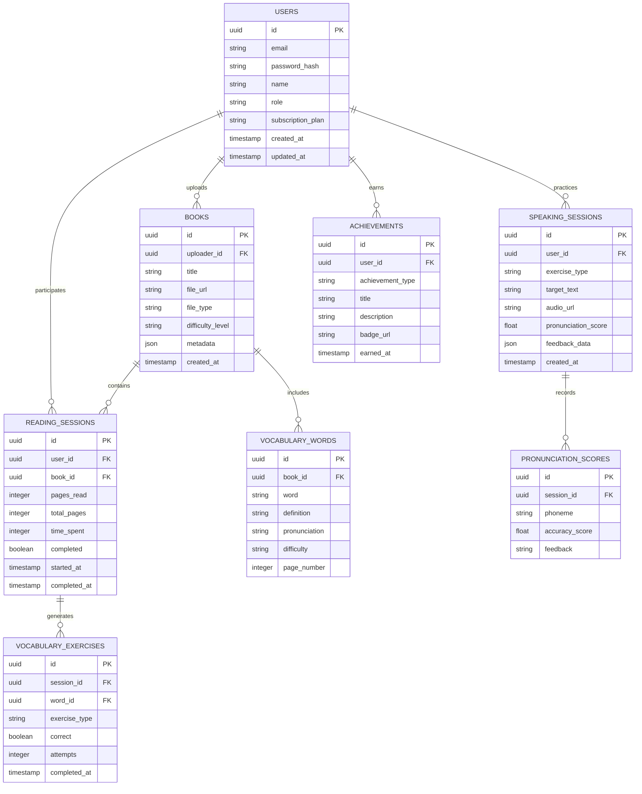

# Interactive English Tutor - Technical Architecture Document

## 1. Architecture Design



## 2. Technology Description

* Frontend: React\@18 + TypeScript + Tailwind CSS + Vite + React Router

* Backend: Express.js\@4 + TypeScript + JWT Authentication

* Database: Supabase (PostgreSQL)

* File Storage: Supabase Storage

* Cache: Redis

* External APIs: OpenAI GPT-4 + Web Speech API + Azure Speech Services

## 3. Route Definitions

| Route            | Purpose                                                 |
| ---------------- | ------------------------------------------------------- |
| /                | Home dashboard with welcome interface and quick actions |
| /library         | Book collection and upload interface                    |
| /reading/:bookId | Interactive reading session for specific book           |
| /speaking        | Speaking practice modules and voice exercises           |
| /rewards         | Achievement center and progress milestones              |
| /dashboard       | Parent/teacher analytics and management panel           |
| /profile         | User settings and account management                    |
| /login           | Authentication page for all user types                  |
| /register        | Registration page with role selection                   |

## 4. API Definitions

### 4.1 Core API

**Authentication**

```
POST /api/auth/login
```

Request:

| Param Name | Param Type | isRequired | Description                               |
| ---------- | ---------- | ---------- | ----------------------------------------- |
| email      | string     | true       | User email address                        |
| password   | string     | true       | User password                             |
| role       | string     | true       | User role (child, parent, teacher, admin) |

Response:

| Param Name | Param Type | Description              |
| ---------- | ---------- | ------------------------ |
| success    | boolean    | Authentication status    |
| token      | string     | JWT access token         |
| user       | object     | User profile information |

**File Upload**

```
POST /api/books/upload
```

Request:

| Param Name | Param Type | isRequired | Description               |
| ---------- | ---------- | ---------- | ------------------------- |
| file       | File       | true       | Book file (PDF, JPG, PNG) |
| title      | string     | true       | Book title                |
| difficulty | string     | false      | Reading difficulty level  |

Response:

| Param Name | Param Type | Description               |
| ---------- | ---------- | ------------------------- |
| success    | boolean    | Upload status             |
| bookId     | string     | Generated book identifier |
| url        | string     | File access URL           |

**Speech Evaluation**

```
POST /api/speech/evaluate
```

Request:

| Param Name | Param Type | isRequired | Description                 |
| ---------- | ---------- | ---------- | --------------------------- |
| audioData  | Blob       | true       | Recorded audio data         |
| targetText | string     | true       | Expected pronunciation text |
| userId     | string     | true       | User identifier             |

Response:

| Param Name | Param Type | Description                    |
| ---------- | ---------- | ------------------------------ |
| score      | number     | Pronunciation accuracy (0-100) |
| feedback   | string     | Improvement suggestions        |
| phonemes   | array      | Detailed phoneme analysis      |

**Progress Tracking**

```
GET /api/progress/:userId
```

Response:

| Param Name        | Param Type | Description                  |
| ----------------- | ---------- | ---------------------------- |
| readingTime       | number     | Total reading minutes        |
| booksCompleted    | number     | Number of finished books     |
| vocabularyLearned | number     | New words learned            |
| speakingScore     | number     | Average speaking performance |

## 5. Server Architecture Diagram



## 6. Data Model

### 6.1 Data Model Definition



### 6.2 Data Definition Language

**Users Table**

```sql
CREATE TABLE users (
    id UUID PRIMARY KEY DEFAULT gen_random_uuid(),
    email VARCHAR(255) UNIQUE NOT NULL,
    password_hash VARCHAR(255) NOT NULL,
    name VARCHAR(100) NOT NULL,
    role VARCHAR(20) NOT NULL CHECK (role IN ('child', 'parent', 'teacher', 'admin')),
    subscription_plan VARCHAR(20) DEFAULT 'free' CHECK (subscription_plan IN ('free', 'premium', 'family')),
    created_at TIMESTAMP WITH TIME ZONE DEFAULT NOW(),
    updated_at TIMESTAMP WITH TIME ZONE DEFAULT NOW()
);

GRANT SELECT ON users TO anon;
GRANT ALL PRIVILEGES ON users TO authenticated;
```

**Books Table**

```sql
CREATE TABLE books (
    id UUID PRIMARY KEY DEFAULT gen_random_uuid(),
    uploader_id UUID REFERENCES users(id),
    title VARCHAR(255) NOT NULL,
    file_url TEXT NOT NULL,
    file_type VARCHAR(10) NOT NULL CHECK (file_type IN ('pdf', 'jpg', 'png')),
    difficulty_level VARCHAR(20) DEFAULT 'beginner' CHECK (difficulty_level IN ('beginner', 'intermediate', 'advanced')),
    metadata JSONB,
    created_at TIMESTAMP WITH TIME ZONE DEFAULT NOW()
);

CREATE INDEX idx_books_uploader_id ON books(uploader_id);
CREATE INDEX idx_books_difficulty ON books(difficulty_level);

GRANT SELECT ON books TO anon;
GRANT ALL PRIVILEGES ON books TO authenticated;
```

**Reading Sessions Table**

```sql
CREATE TABLE reading_sessions (
    id UUID PRIMARY KEY DEFAULT gen_random_uuid(),
    user_id UUID REFERENCES users(id),
    book_id UUID REFERENCES books(id),
    pages_read INTEGER DEFAULT 0,
    total_pages INTEGER,
    time_spent INTEGER DEFAULT 0,
    completed BOOLEAN DEFAULT FALSE,
    started_at TIMESTAMP WITH TIME ZONE DEFAULT NOW(),
    completed_at TIMESTAMP WITH TIME ZONE
);

CREATE INDEX idx_reading_sessions_user_id ON reading_sessions(user_id);
CREATE INDEX idx_reading_sessions_book_id ON reading_sessions(book_id);

GRANT SELECT ON reading_sessions TO anon;
GRANT ALL PRIVILEGES ON reading_sessions TO authenticated;
```

**Speaking Sessions Table**

```sql
CREATE TABLE speaking_sessions (
    id UUID PRIMARY KEY DEFAULT gen_random_uuid(),
    user_id UUID REFERENCES users(id),
    exercise_type VARCHAR(50) NOT NULL,
    target_text TEXT NOT NULL,
    audio_url TEXT,
    pronunciation_score DECIMAL(5,2),
    feedback_data JSONB,
    created_at TIMESTAMP WITH TIME ZONE DEFAULT NOW()
);

CREATE INDEX idx_speaking_sessions_user_id ON speaking_sessions(user_id);
CREATE INDEX idx_speaking_sessions_score ON speaking_sessions(pronunciation_score DESC);

GRANT SELECT ON speaking_sessions TO anon;
GRANT ALL PRIVILEGES ON speaking_sessions TO authenticated;
```

**Initial Data**

```sql
-- Sample achievement types
INSERT INTO achievements (user_id, achievement_type, title, description, badge_url) VALUES
('sample-user-id', 'reading_streak', 'Reading Champion', 'Read for 7 consecutive days', '/badges/reading-champion.png'),
('sample-user-id', 'vocabulary_master', 'Word Wizard', 'Learned 100 new vocabulary words', '/badges/word-wizard.png'),
('sample-user-id', 'pronunciation_pro', 'Speaking Star', 'Achieved 90% pronunciation accuracy', '/badges/speaking-star.png');
```

